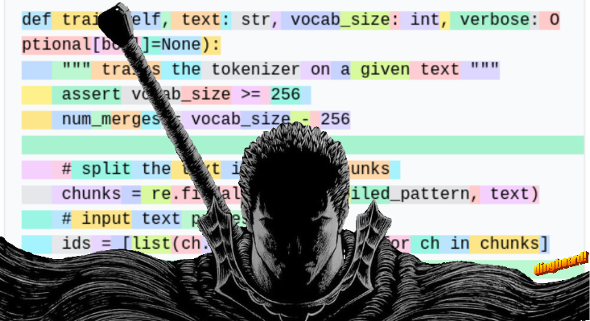

# Byte-Pair Encoding

<p align="center">
    
</p>

- Original Paper: https://arxiv.org/pdf/1508.07909
- GPT2 Paper: https://d4mucfpksywv.cloudfront.net/better-language-models/language-models.pdf
- minBPE repo: https://github.com/karpathy/minbpe?tab=readme-ov-file
- Wiki: https://en.wikipedia.org/wiki/Byte_pair_encoding

## How to use: 

- To train of a text file
```python
text = open("input.txt", "r", encoding="utf-8").read()

tokenizer = GPTTokenizer("gpt4")
tokenizer.train(text, 512, verbose=True)

prefix = os.path.join("models", name)
tokenizer.save("gpt4")
```
